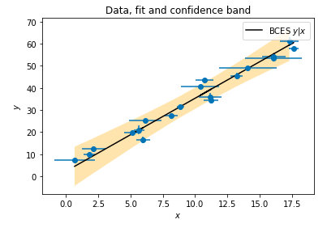

BCES: Linear regression for data with measurement errors and intrinsic scatter
=========================================

Python module for performing robust linear regression on (X,Y) data points where both X and Y have measurement errors. 

The fitting method is the *bivariate correlated errors and intrinsic scatter* (BCES) and follows the description given in [Akritas & Bershady. 1996, ApJ](http://labs.adsabs.harvard.edu/adsabs/abs/1996ApJ...470..706A/). Some of the advantages of BCES regression compared to ordinary least squares fitting (quoted from Akritas & Bershady 1996):

* it allows for measurement errors on both variables
* it permits the measurement errors for the two variables to be dependent
* it permits the magnitudes of the measurement errors to depend on the measurements
* other "symmetric" lines such as the bisector and the orthogonal regression can be constructed.

In order to understand how to perform and interpret the regression results, please read the paper. 

## Installation

Using `pip`:

    pip install bces

Alternatively, if you plan to modify the source then install the package with a symlink, so that changes to the source files will be immediately available:

    pip install -e .


## Usage 

	import bces.bces as BCES
	a,b,aerr,berr,covab=BCES.bcesp(x,xerr,y,yerr,cov)

Arguments:

- *x,y* : 1D data arrays
- *xerr,yerr*: measurement errors affecting x and y, 1D arrays
- *cov* : covariance between the measurement errors, 1D array

If you have no reason to believe that your measurement errors are correlated (which is usually the case), you can provide an  array of zeroes as input for *cov*:

    cov = numpy.zeros_like(x)

Output:

- *a,b* : best-fit parameters a,b of the linear regression such that *y = Ax + B*. 
- *aerr,berr* : the standard deviations in a,b
- *covab* : the covariance between a and b (e.g. for plotting confidence bands)

Each element of the arrays *a*, *b*, *aerr*, *berr* and *covab* correspond to the result of one of the different BCES lines: *y|x*, *x|y*, bissector and orthogonal, as detailed in the table below. Please read the [original BCES paper](http://labs.adsabs.harvard.edu/adsabs/abs/1996ApJ...470..706A/) to understand what these different lines mean.


| Element  | Method  |  Description |
|---|---| --- |
| 0  | *y\|x*  | Assumes *x* as the independent variable |
| 1  |  *x\|y* | Assumes *y* as the independent variable |
| 2  | bissector  | Line that bisects the *y\|x* and *x\|y*. This approach is self-inconsistent, *do not use this method*, cf. [Hogg, D. et al. 2010, arXiv:1008.4686](http://labs.adsabs.harvard.edu/adsabs/abs/2010arXiv1008.4686H/). |
| 3  | orthogonal  | Orthogonal least squares: line that minimizes orthogonal distances. Should be used when it is not clear which variable should be treated as the independent one |

By default, `bcesp` run in parallel with bootstrapping.


## Examples

[`bces-examples.ipynb` is a jupyter notebook](https://github.com/rsnemmen/BCES/blob/master/doc/bces-examples.ipynb) including a practical, step-by-step example of how to use BCES to perform regression on data with uncertainties on x and y. It also illustrates how to plot the confidence band for a fit.



If you have suggestions of more examples, feel free to add them.


## Running Tests

To test your installation, run the following command inside the BCES directory:

```bash
pytest -v
```


## Requirements

See `requirements.txt`.


## Citation

If you end up using this code in your paper, you are morally obliged to cite the following works 

- [Nemmen, R. et al. *Science*, 2012, 338, 1445](http://labs.adsabs.harvard.edu/adsabs/abs/2012Sci...338.1445N/) ([bibtex citation info](http://adsabs.harvard.edu/cgi-bin/nph-bib_query?bibcode=2012Sci...338.1445N&data_type=BIBTEX&db_key=AST&nocookieset=1)) 
- The original BCES paper: [Akritas, M. G., & Bershady, M. A. Astrophysical Journal, 1996, 470, 706](http://labs.adsabs.harvard.edu/adsabs/abs/1996ApJ...470..706A/) 

I spent considerable time writing this code, making sure it is correct and *user-friendly*, so I would appreciate your citation of the first paper in the above list as a token of gratitude.

If you are *really* happy with the code, you can buy me a coffee.
[](https://www.buymeacoffee.com/nemmen)

